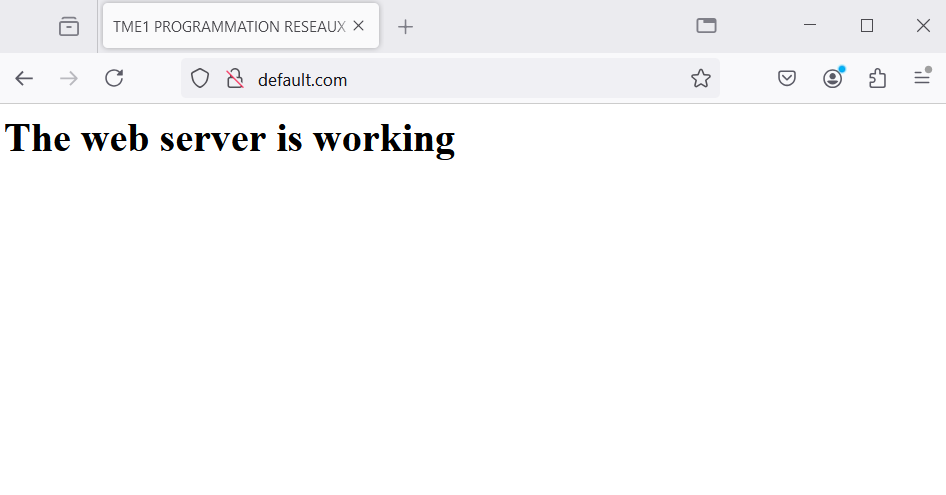

# NETWORK PROGRAMMING: Project report 1

## Table of Contents
1. [Project Structure](#project-structure)
2. [Server-Client Architecture](#server-client-architecture)
3. [1 - Relay-Based Client-Server Time Request System](#1---relay-based-client-server-time-request-system)
   - [Overview](#overview)
   - [Reused Components](#reused-components)
   - [File Descriptions](#file-descriptions)
   - [How the System Works](#how-the-system-works)
   - [Usage Instructions](#usage-instructions)
   - [Example Output](#example-output)
   - [Error Handling and Improvements](#error-handling-and-improvements)
4. [2 - HTTP server with caching, logging, and censoring](#2---http-server-with-caching-logging-and-censoring)
   - [Overview](#overview)
   - [Components](#components)
   - [How to Run](#how-to-run)
   - [How to Test](#how-to-test)
   - [Chain Testing](#chain-testing)
   - [Files](#files)
   - [Default and banned http server response displays](#default-and-banned-http-server-response-displays)
5. [Conclusion](#conclusion)

## Project Structure 
```bash
MINI-PROJET 1
│
├── exo1
│   ├── ClientHorloge MP1.py
│   ├── RelayHorloge MP1.py
│   └── ServerHorloge MP1.py
│
└── exo2
    ├── CacheRelay.py
    ├── CensorRelay.py
    ├── HTTPserver.py
    └── SnifferRelay.py
```

## Server-Client Architecture

All the components in this project (the HTTP server and the relays) follow a consistent architecture:
- **run_server**: This function initializes the server or relay socket, binds it to a specific port, and listens for incoming client connections. It is the main function responsible for running the server.
- **handle_client**: This function is responsible for processing each client connection. For each incoming request, a new thread is created, and the `handle_client` function is used to process and respond to that client.
- **run_client** (applicable in some components): Manages the client's connection to the server and handles sending and receiving data.

### `if __name__ == "__main__"` Pattern

In each Python script, the code that starts the server or relay is wrapped in the `if __name__ == "__main__"` block. This ensures that the server is only started when the script is run directly and not when it is imported as a module. This is a common Python convention that allows scripts to be reusable and modular.

## 1 - Relay-Based Client-Server Time Request System


### Overview

This project demonstrates a **client-server** architecture with a **relay** in between. The **client** sends a request to the **server** through a **relay**, which forwards the request and the server’s response. The system is designed to calculate the time difference between when a message is sent by the client and when the response is received.

The primary functionality includes:
- The **client** sends a specific number of requests asking for the server's time.
- The **server** responds with its current time for each request.
- The **relay** intercepts all communications, forwarding them between the client and server.

### Reused Components

The **client** and **server** components were adapted from **TME1**, an earlier exercise. In this project:
- The **client** and **server** from TME1 have been reused to handle time request messages and responses.
- The **relay** is introduced to handle forwarding between the client and server.

Only minor changes were made to the TME1 client:
- The server’s IP and port were updated to point to the **relay**.
- The **relay** then communicates with the original server without modifying the TME1 code significantly.

### File Descriptions

1. **ClientHorloge MP1.py**:  
   - Sends a request count (integer) to the relay and requests the server's current time multiple times.
   - Computes the time difference between sending the request and receiving the server's response.
   
2. **RelayHorloge MP1.py**:  
   - Acts as a middleman between the client and server.
   - Forwards the client's request to the server and sends the server's response back to the client.

3. **ServerHorloge MP1.py**:  
   - Receives the request from the relay, provides the current server time for each request, and sends the time back to the relay.

### How the System Works

#### Client Workflow:
1. The client connects to the **relay** (default: `localhost:5555`).
2. It sends a request count (e.g., 5), indicating how many times it wants the server's time.
3. For each request:
    - The client sends a message: `"what time is it?"`
    - The client records the time the message was sent.
    - It waits for the **relay** to send back the **server's** time.
    - The client then calculates the time difference between sending the request and receiving the server’s time.

#### Relay Workflow:
1. The **relay** listens on a designated port (default: `5555`) for client connections.
2. Upon receiving a connection from the client:
    - The **relay** forwards the request to the server (default: `localhost:1236`).
    - The **relay** then listens for the server's response and sends it back to the client.

#### Server Workflow:
1. The **server** listens on a specific port (default: `1236`).
2. When it receives a request from the **relay**:
    - It processes the message and responds with its current system time in ISO format.
3. The **relay** forwards the server's time response back to the client.

### Usage Instructions
 I personally used vscode to do all the project, but since these are python files, they can be ran on a cmd terminal.  
#### Prerequisites:
- Python 3.x installed.
- Ensure the ports (default `5555` for the relay and `1236` for the server) are available.

#### Steps to Run the Project:

1. **Start the server**:
   - Open a terminal and navigate to the project directory.
   - Run the server:
     ```bash
     python3 ServerHorloge MP1.py
     ```
   - The server will start listening for requests on port `1236`.
     ```
     Server ready for connection requests on port 1236...
     ```

2. **Start the relay**:
   - In a new terminal window:
     ```bash
     python3 RelayHorloge MP1.py
     ```
   - The relay will start listening on port `5555` and will forward requests to the server on port `1236`.
     ```
     Relay listening on port 5555...
     ```

3. **Run the client**:
   - Open another terminal and run the client:
     ```bash
     python3 ClientHorloge MP1.py
     ```
   - The client will prompt for the number of requests. Enter an integer (e.g., `5`), and it will send that many time requests to the server through the relay.
   - The client will display the server's time response and the computed time difference for each request.
     ```
     What's the request count? 5
     ```
#### Example Output:
```
Connected to server localhost:5555
Sent request count: 5
Sent request 1: 2024-10-10T11:38:40.747159
Request 1: sent at 2024-10-10T11:38:40.747159, received at 2024-10-10T11:38:40.747159
Server time: 2024-10-10T11:38:40.747159, Time difference: 0:00:00
Sent request 2: 2024-10-10T11:38:41.857683
Request 2: sent at 2024-10-10T11:38:41.857683, received at 2024-10-10T11:38:41.857683
Server time: 2024-10-10T11:38:41.857683, Time difference: 0:00:00
Sent request 3: 2024-10-10T11:38:43.687086
Request 3: sent at 2024-10-10T11:38:43.687086, received at 2024-10-10T11:38:43.687590
Server time: 2024-10-10T11:38:43.687590, Time difference: 0:00:00.000504
Sent request 4: 2024-10-10T11:38:45.022559
Request 4: sent at 2024-10-10T11:38:45.022559, received at 2024-10-10T11:38:45.022559
Server time: 2024-10-10T11:38:45.022559, Time difference: 0:00:00
Sent request 5: 2024-10-10T11:38:46.903296
Request 5: sent at 2024-10-10T11:38:46.903296, received at 2024-10-10T11:38:46.903296
Server time: 2024-10-10T11:38:46.903296, Time difference: 0:00:00 
```

### Error Handling and Improvements
- Both the server and relay handle client disconnections by closing the socket.

## 2 - HTTP server with caching, logging and censoring 


### Overview
This project implements an HTTP Relay system with caching, logging, and censorship capabilities. The relays sit between an HTTP client (typically a web browser) and an HTTP server, modifying or monitoring the communication as specified. It consists of the following components:
- **HTTP Cache Relay**
- **HTTP Logger Relay**
- **HTTP Censor Relay**
- **Basic HTTP Server**

Each relay can work independently or be chained together to handle client requests progressively.

### Components

#### 1. HTTP Cache Relay
- **File**: `CacheRelay.py`
- **Functionality**: Caches the first server response for a requested URI. If the same URI is requested again, the relay serves the cached response, avoiding a new request to the server.
- **Key Functions**:
  - `handle_client`: Processes incoming requests, serves from cache if available, or forwards the request to the server and caches the response.

#### 2. HTTP Logger Relay
- **File**: `SnifferRelay.py`
- **Functionality**: Logs client GET requests and non-empty server responses to a log file for auditing purposes.
- **Key Functions**:
  - `log_request`: Records the client's IP, the requested URI, and the server's response to a log file for future audits.

#### 3. HTTP Censor Relay
- **File**: `CensorRelay.py`
- **Functionality**: Blocks access to banned websites. If a client requests a forbidden URI, the relay responds with a "403 Forbidden" message. The request is logged.
- **Key Functions**:
  - `is_forbidden`: Checks if a requested URI contains a banned site.
  - `log_blocked_request`: Logs the client's IP and the forbidden request.

#### 4. Basic HTTP Server
- **File**: `HTTPserver.py`
- **Functionality**: Simple HTTP server that responds to GET requests with a basic HTML page. This server is used for testing the relays.
- **Key Functions**:
  - `handle_client`: Manages client connections and serves the requested HTML content.

### How to Run

1. Run the server and relays exactly the same way we did in exo 1 either by using a cmd terminal or directly in vscode by running them on separate terminals. 

2. **Set up the Proxy**: In your web browser (example: Firefox), configure the proxy settings to use `localhost` and the appropriate port (example: `5555` for the Cache relay).

### How to Test

- Open a web browser and request a URL from the server.
- The request will be passed through the Cache Relay. If it's the first time, the response will be cached. On subsequent requests, the cached response will be served.
- The Logger Relay will log all client requests and server responses in `http_sniffer_log.txt`.
- If you try to access a banned site, the Censor Relay will block the request and log the event in `blocked_requests_log.txt`.

### Chain Testing
To chain the relays:
- Cache → Logger → Censor → Server
Set the proxy address of each relay to point to the next in the chain (example: Cache relay points to the Logger(sniffer), Logger to the Censor, and Censor to the Server).

### *Displays*: efault and banned http server response 


*Figure 1: default http server response/web-page*


*Figure 2: Censor response to a banned page access request*


### Conclusion
This project demonstrates an HTTP relay system capable of caching responses, logging requests, and censoring forbidden content. Each relay operates as a standalone component or can be chained to handle requests progressively.